# Blockchain-18-HMW

## Running a Proof of Authority Blockchain, Connecting Keystore Wallets & Sending a Transaction by Creating a Custom Local Network

---
For this exercise you will be creating a separate account for each node. To do this you must first download the dependencies for connecting to and running nodes on your local machine.

Visit: https://geth.ethereum.org/downloads/ 
* scroll down to Geth&Tools 1.9.7 
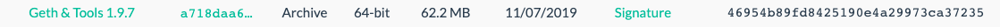
* open and save these tools in a folder somewhere you can access easily 

---
Next, open your terminal and navigate to the directory where you saved these tools
* enter ls command to confirm 'puppeth' is in this folder
* create two accounts, one for each node:
* * ./geth --datadir node1 account new
* * ./geth --datadir node2 account new
* you will be promted to create passwords for each, save those
* copy the public address for each account and save them in notepad (label them accordingly)

---
Next you will generate a new genesis block 
*  ./puppeth 
* name your network "myfintech" (refrain from using caps, spaces or special characters)
* press >2 configure new genesis
* press >1 create new genesis from scratch
* press >2 Clique-proof of authority
* then paste each account adress (minus the 0x prefix)
* paste addresses again to pre-fund (there are no block rewards for POA)
* type yes to pre-fund with 1 wei
* type a chain/netword id= "123" (save this ID in notepad)
* back at main menu - continue with "Manage existing genesis"
* choose "export genesis configuration"
* type ls, this should show a networkname.json file in your directory along with your geth tools
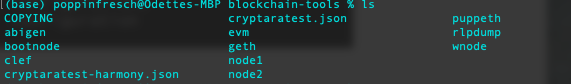
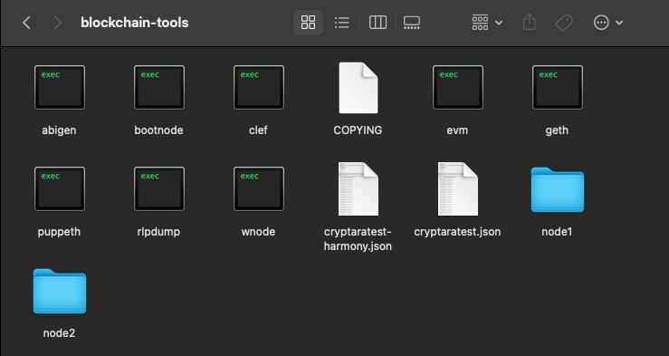

---
Next we will use the networkname.json you just exported to initialize the nodes we created with your two accound addresses.  In your CLI:
* ./geth --datadir node1 init networkname.json
* ./geth --datadir node2 init networkname.json

Now you can use the nodes to begin mining new blocks. In your CLI:
* ./geth --datadir node1 --unlock "NODE1_PUBLIC_ADRESS" --mine --rpc --allow-insecure-unlock
* * enter your password for node1 account
* * find your self=enode and copy the entire line afer the "="

In NEW terminal window (same directory):
* ./geth --datadir node2 --unlock "NODE2_PUBLIC_ADDRESS" --mine --port 30304 --bootnodes "PASTE_ENODE://_HERE" --ipcdisable --allow-insecure-unlock
* * enter your password for node2 account
Even if you dont see the promt, enter the password and you will see the nodes begin to update the network continuously. 

---
Now that your nodes are up and running, you can connect to your new local network on your MyCrypto app!
* on the bottom LH corner click change network

* add custom node
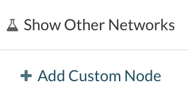
* enter custom network, network name, chain ID you created, and local network URL
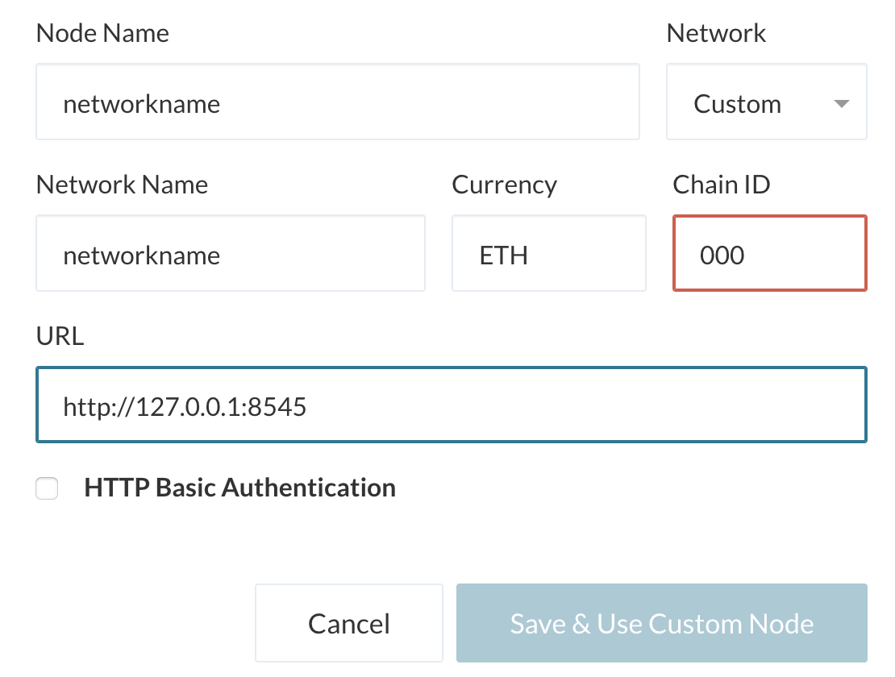
* Save & Use custom Node
* confirm you are on custom networkname

---
You are now ready to view and send money within your custom network using the accounts you created!
* select the "View and Send" option from tabs on the left
* select Keystore File (both node accounts we created are keystore wallets)
* click "select wallet file", navigate to your directory where you savd your geth tools, select node1, keystore, and upen the UTC file
* enter the password you saved for account1 (node1), unlock wallet
* you should see millions of ETH in your wallet!
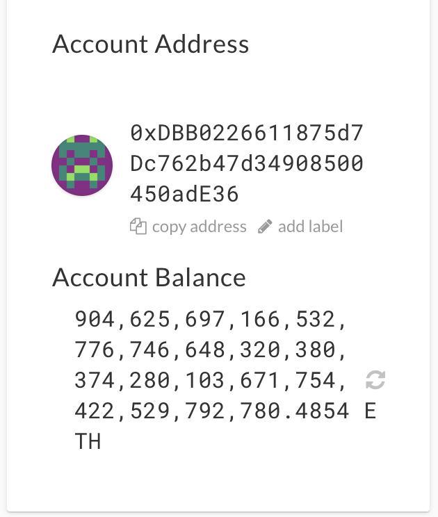

---
Now lets test it out and send a transaction on your local network!
* select "Send Ether & Tokens"
* enter the public address for your other account
* enter noticable amount and send
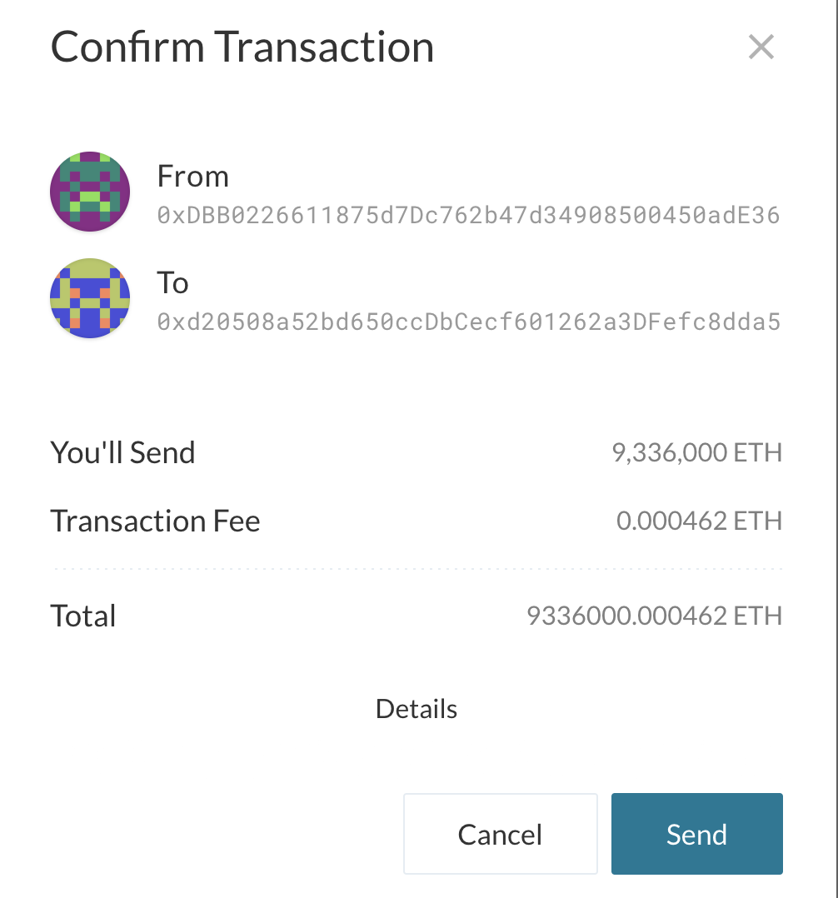
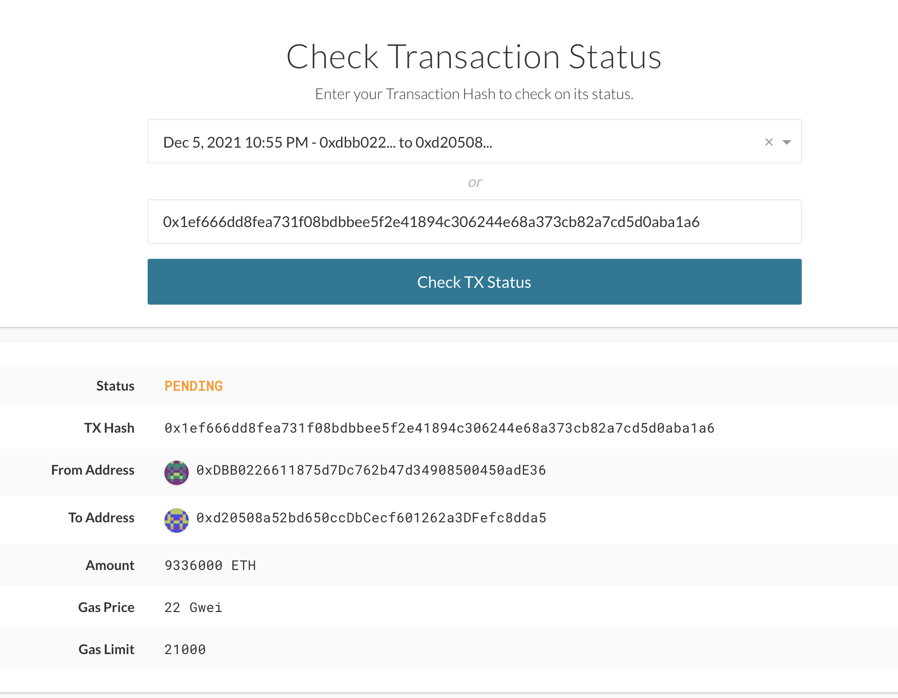
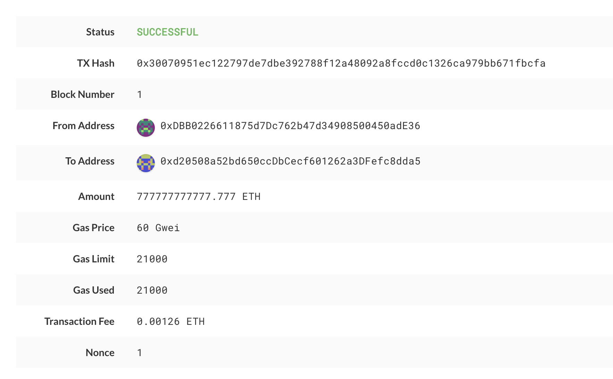

You've successfully completed your first block on your private blockchain.

---

## BONUS:

If you want to check your new balance in code
* navigate to parent directory containing the folder with your Geth tools
* touch crypto.py
* code crypto.py  - to open in vs code
* enter code below:
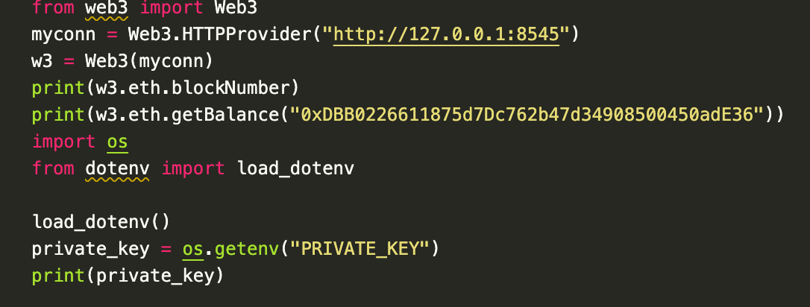
* include .env file with your account1 private key (you can grab this from mycrypto app "wallet info")
* save and navigate back to terminal directory containing crypto.py
* run > python crypto.py
* you should see your blocks mined, balance, and account address.

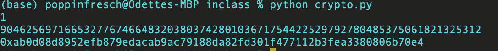

